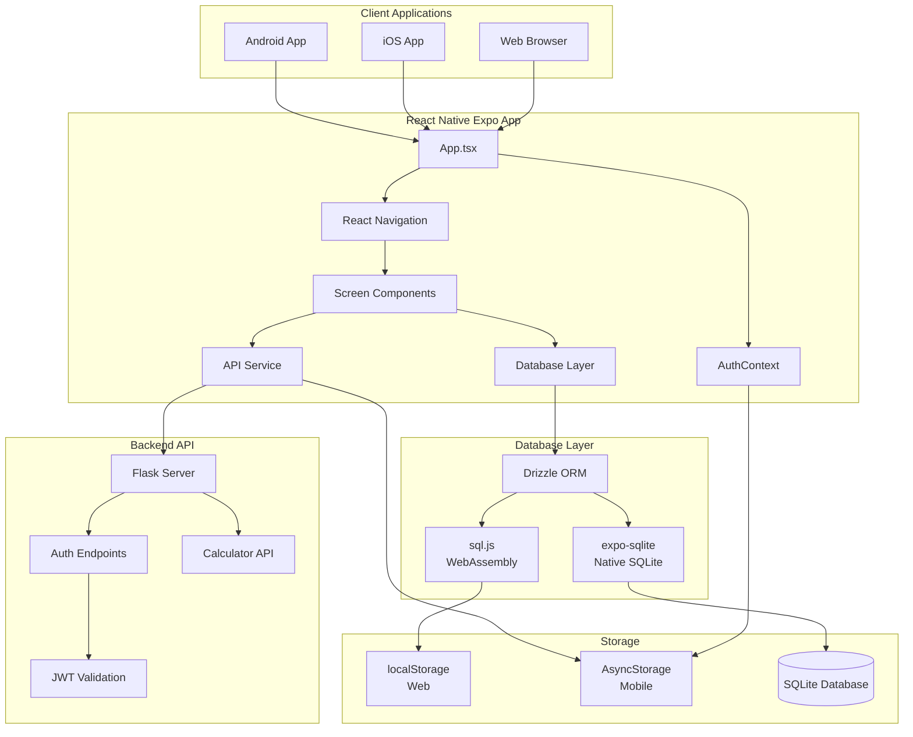
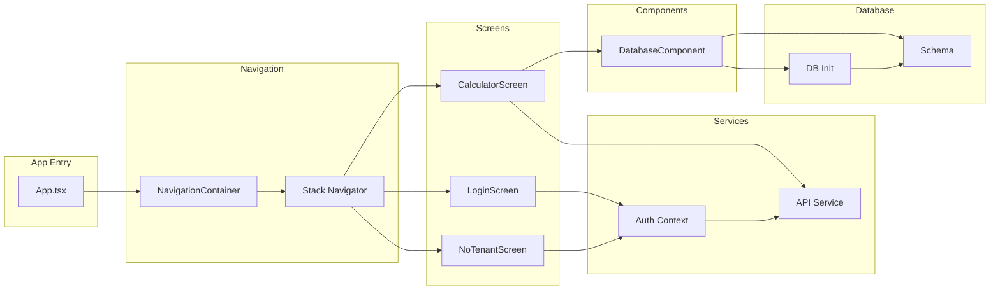
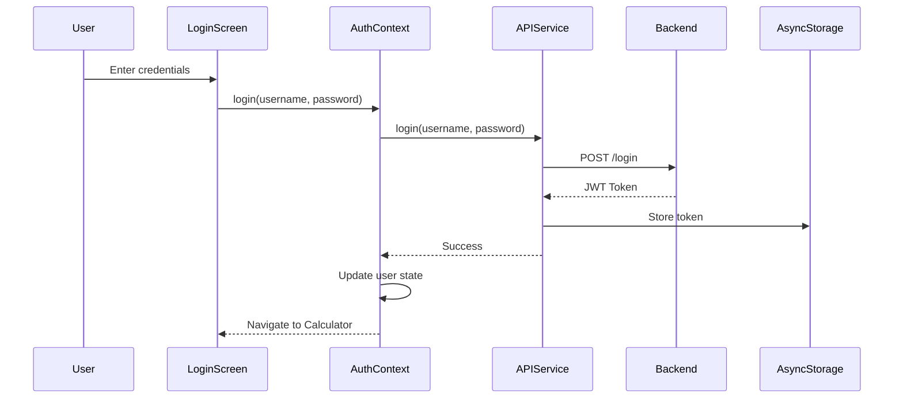
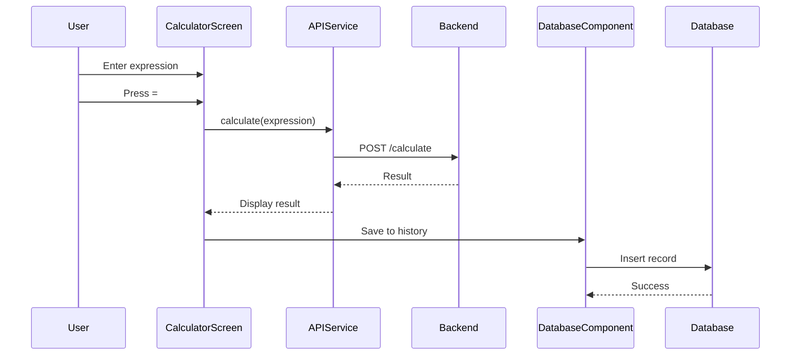
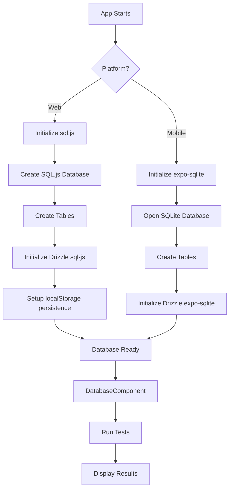
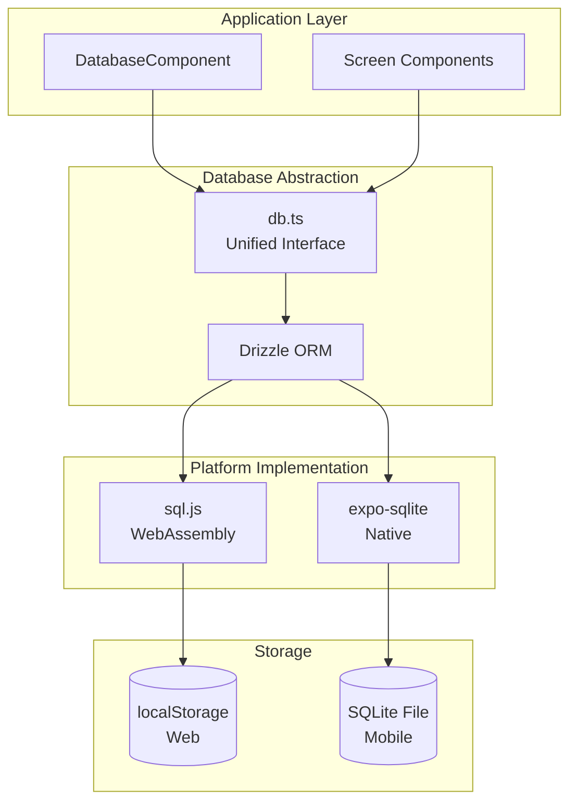
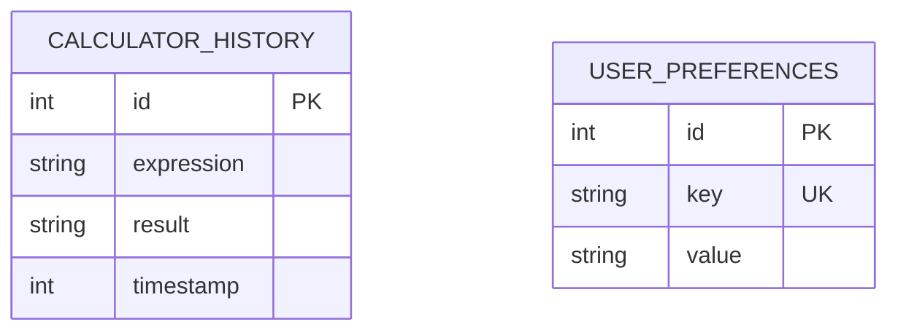
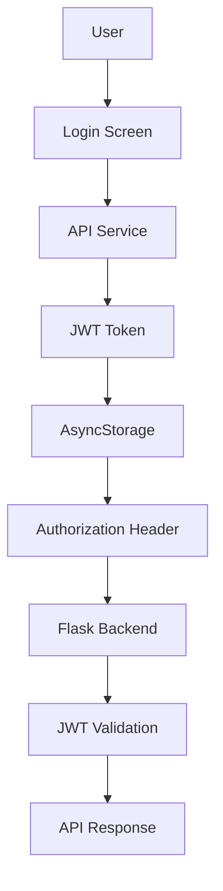

# Architecture Documentation

## System Architecture



## Component Architecture



## Data Flow

### Authentication Flow



### Calculation Flow



### Database Initialization Flow



## Database Architecture

### Unified Database Interface



### Schema Structure



## Technology Stack

### Frontend Stack

```
┌─────────────────────────────────────┐
│     React Native Expo               │
│  ┌───────────────────────────────┐  │
│  │  TypeScript (Strict Mode)     │  │
│  └───────────────────────────────┘  │
│  ┌───────────────────────────────┐  │
│  │  React Navigation             │  │
│  └───────────────────────────────┘  │
│  ┌───────────────────────────────┐  │
│  │  React Context API            │  │
│  └───────────────────────────────┘  │
└─────────────────────────────────────┘
```

### Database Stack

```
┌─────────────────────────────────────┐
│     Drizzle ORM                     │
│  ┌──────────────┐  ┌──────────────┐ │
│  │  sql.js      │  │ expo-sqlite  │ │
│  │  (Web)       │  │ (Mobile)     │ │
│  └──────────────┘  └──────────────┘ │
└─────────────────────────────────────┘
```

### Backend Integration

```
┌─────────────────────────────────────┐
│     Flask REST API                  │
│  ┌───────────────────────────────┐  │
│  │  JWT Authentication           │  │
│  └───────────────────────────────┘  │
│  ┌───────────────────────────────┐  │
│  │  Calculator Endpoints         │  │
│  └───────────────────────────────┘  │
└─────────────────────────────────────┘
```

## Platform-Specific Implementation

### Web Platform

```
Browser
  ↓
React Native Web
  ↓
sql.js (WebAssembly)
  ↓
localStorage (Persistence)
```

### Mobile Platform

```
iOS/Android
  ↓
React Native
  ↓
expo-sqlite (Native)
  ↓
SQLite File (Persistence)
```

## Security Architecture



## File Structure

```
mobile-app/
├── App.tsx                    # Entry point, navigation setup
├── src/
│   ├── screens/              # Screen components
│   │   ├── LoginScreen.tsx
│   │   ├── CalculatorScreen.tsx
│   │   └── NoTenantScreen.tsx
│   ├── services/             # External services
│   │   └── api.ts           # API client, token management
│   ├── utils/               # Utilities
│   │   └── AuthContext.tsx  # Authentication state management
│   ├── components/          # Reusable components
│   │   └── DatabaseComponent.tsx
│   └── db/                  # Database layer
│       ├── schema.ts        # Drizzle schema definitions
│       └── db.ts            # Database initialization
├── tsconfig.json            # TypeScript configuration
├── .eslintrc.js            # ESLint configuration
└── package.json            # Dependencies
```

## Key Design Decisions

### 1. Unified Database Interface
- **Decision**: Use Drizzle ORM with platform-specific implementations
- **Rationale**: Single codebase, platform-specific optimizations
- **Benefits**: Code reuse, type safety, consistent API

### 2. TypeScript Strict Mode
- **Decision**: Enable strict type checking
- **Rationale**: Catch errors at compile time, better IDE support
- **Benefits**: Type safety, self-documenting code

### 3. Context API for State
- **Decision**: Use React Context instead of Redux
- **Rationale**: Simpler for this project size, less boilerplate
- **Benefits**: Built-in React, easier to understand

### 4. Token-Based Authentication
- **Decision**: JWT tokens stored in AsyncStorage
- **Rationale**: Works across all platforms, stateless
- **Benefits**: No server-side sessions, mobile-friendly

### 5. Platform Detection
- **Decision**: Runtime platform detection for database
- **Rationale**: Single codebase, platform-specific optimizations
- **Benefits**: Code reuse, optimal performance per platform
